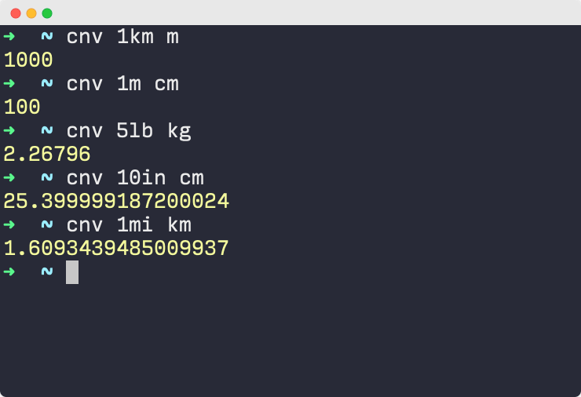

# cnv

CLI tool to convert units in the command line. This module uses the [convert-units](https://github.com/convert-units/convert-units) module under the hood.



## Motivation

I built this for myself, because I usually google to convert units. This allows me to do any conversions quickly (and offline) right in my terminal.

I also wanted to build something using Typescript and test it using [ava](https://github.com/avajs/ava).

## Installation

Install `cnv` globally 

```
npm i -g cnv
```

To install it locally, use `npm i cnv` instead.

## Usage

```bash
cnv 50km m
```

Some more examples:

```bash
cnv 1m cm
cnv 1lb kg
cnv 100oz ml
```

## Features to be added

* [ ] Better error handling (currently it throws any error convert-units throws which is informative but not pretty)

## Test

cnv is tested using [ava](https://github.com/avajs/ava).

To run tests: 

1. Setup the repository locally using: 

```
git clone git@github.com:nkhil/cnv.git
cd cnv
npm install 
```

2. Run tests: 

```
npm t
```
